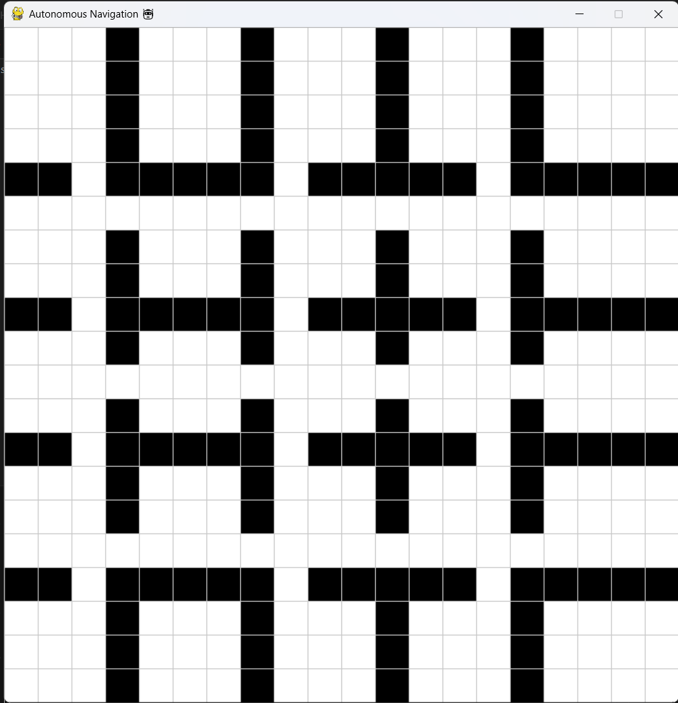
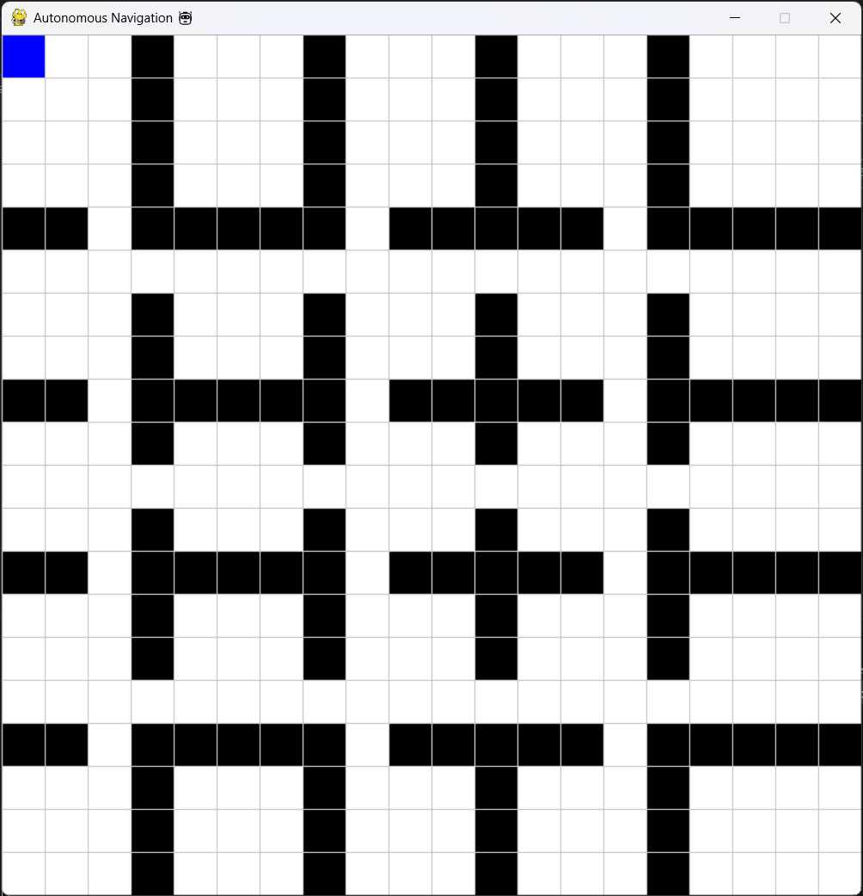
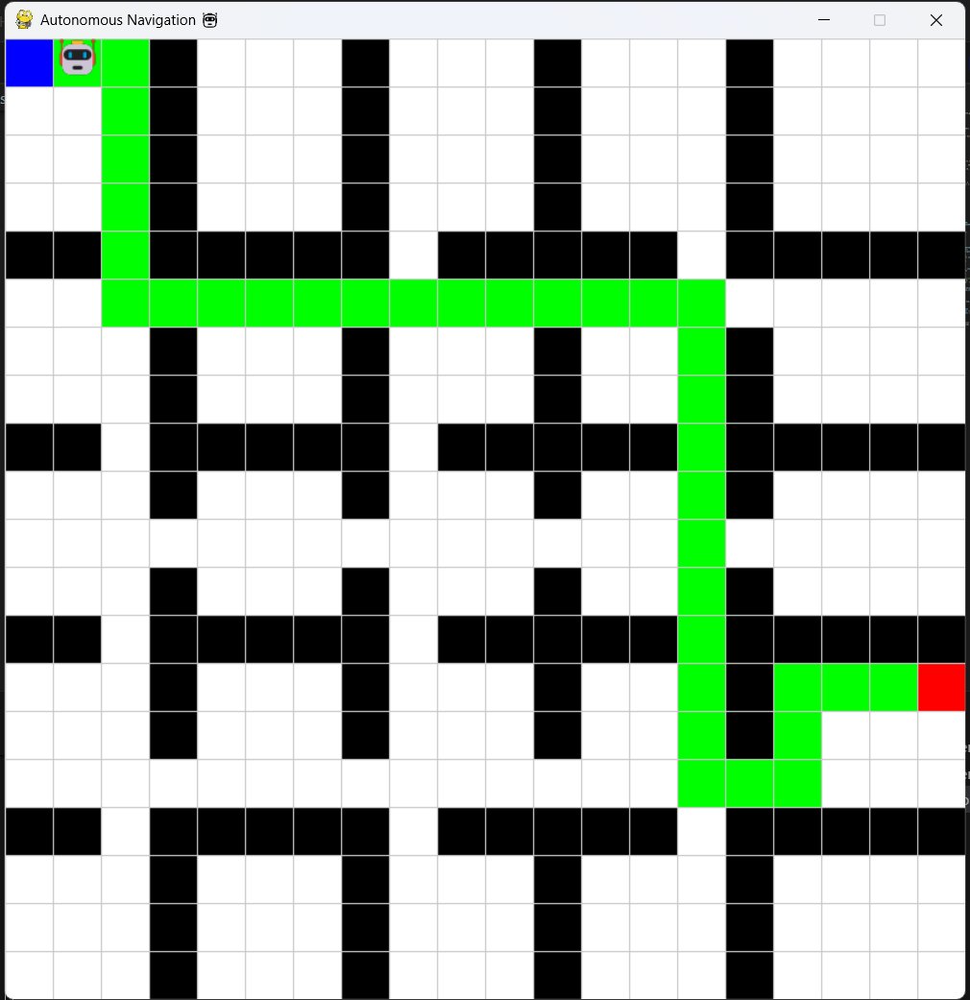
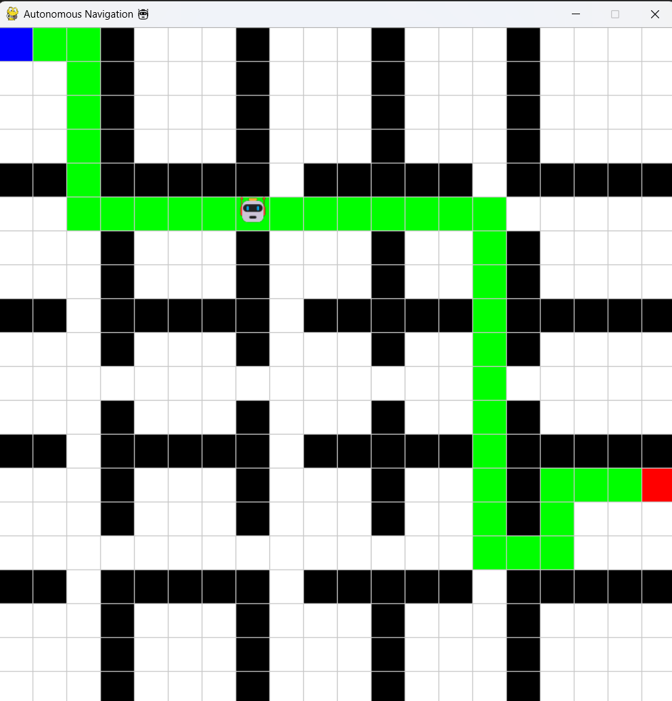
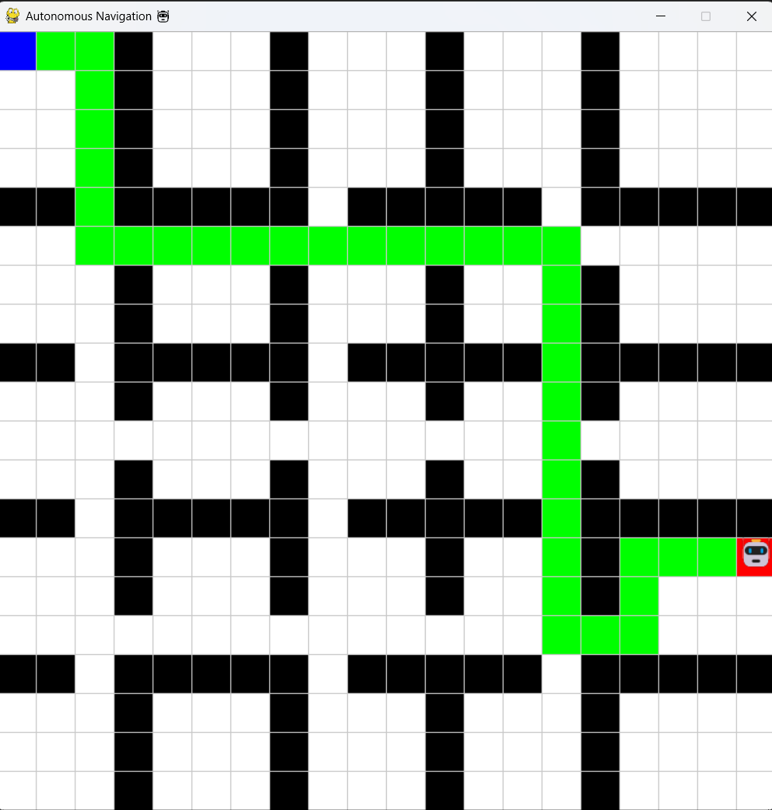

# 🤖 AI Autonomous Navigation System

> 📍 Simulates intelligent navigation using A* algorithm in a grid-based environment with obstacles.

---

## 🚀 Features

* Grid-based environment
* Obstacle handling (city-like layout)
* A* pathfinding algorithm
* Visual path representation
* Robot movement simulation 🤖

---

## 🖼️ Output Screenshots

### 🟢 Grid with Obstacles



### 🔵 Start Point Selection



### 🔷 Path Planning



### 🤖 Robot Navigation



### 🎯 Goal Reached



---

## ⚙️ Installation

```bash
pip install -r requirements.txt
```

---

## ▶️ Run the Project

```bash
python src/main.py
```

---

## 🧠 Algorithm Used

* A* (A-Star) Search Algorithm
* Heuristic-based shortest path finding

---
## 🛠️ Tech Stack

- Python
- Pygame
- A* Algorithm

## 📌 Future Improvements

* Diagonal movement
* Dynamic obstacles
* Real-time navigation

---

## 👩‍💻 Author

**Kiranmayee Sivvam**
